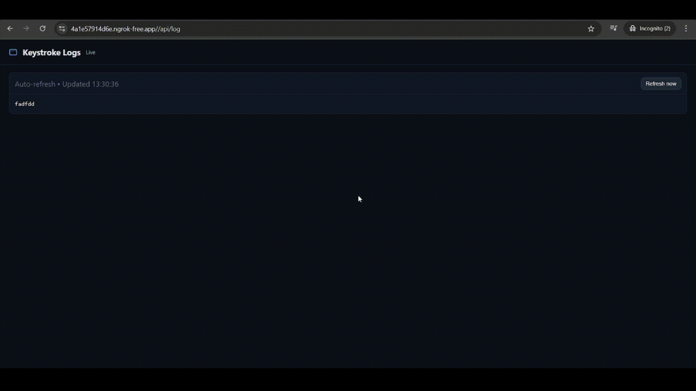

```markdown
# Online Keylogger & C2 Server



A client-server-based Python keylogger designed for educational purposes to demonstrate concepts in cybersecurity, network communication, and system monitoring. The client captures keystrokes and sends them to a remote server, which logs the data and provides a simple web interface to view it.

## ⚠️ Ethical Disclaimer

This tool is intended strictly for **educational and authorized testing purposes only**. The motivation behind this project was to understand client-server architecture, data exfiltration techniques, and defensive measures.

- **DO NOT use this on any computer you do not own or have explicit, written permission to monitor.**
- Unauthorized keystroke logging is **illegal** in most jurisdictions and constitutes a serious invasion of privacy.
- The author is **not responsible** for any misuse or damage caused by this software. Use it responsibly and ethically.

---

## Project Overview

This project is composed of two main parts:

1.  **`keylogger.py` (The Client):** A Python script that runs on the target machine. It captures all keyboard input, stores it temporarily, and sends it to a remote server via an HTTP POST request [2]. It is designed to run silently in the background [2].
2.  **`server.py` (The Server):** A Flask web server that acts as a Command and Control (C2) listener [3]. It has an API endpoint to receive the data from the client and saves it to a log file. It also provides a simple web page to view the captured keystrokes in real-time [3].

## Features

- **Real-time Keystroke Capture:** Logs every key pressed on the host machine [2].
- **Client-Server Architecture:** Keystrokes are exfiltrated to a remote server over the internet [2, 3].
- **Web-Based Log Viewer:** The server provides a simple HTML interface to view all captured logs from any browser [3].
- **Stealth Operation:** The client runs without any visible window or icon (verbose console mode is available for debugging) [2].
- **Graceful Shutdown:** The client sends any remaining cached keystrokes to the server before exiting when the `Esc` key is pressed [2].
- **Easy Deployment with Ngrok:** The server script integrates `pyngrok` to automatically create a secure public URL for the local server, making it accessible from anywhere.

---

## Technologies Used

- **Python 3:** The core programming language for both client and server.
- **Flask:** A micro web framework used to create the server-side API and log viewer [3].
- **Pynput:** A Python library to capture and control user input devices, used here for hooking keyboard events [2].
- **Requests:** A simple HTTP library for Python, used by the client to send data to the server [2].
- **Threading:** A standard Python library used to run the client's optional status spinner without blocking the main logging thread [2].
- **Standard Libraries:** `os`, `sys`, and `time` are used for file system interaction, system path manipulation, and process handling [2, 3].

---

## Setup and Usage

### Prerequisites

- Python 3.7+
- `pip` package manager

### 1. Installation

Clone the repository and install the required dependencies.

```
git clone <your-repo-link>
cd <your-repo-directory>
pip install -r requirements.txt
```

Create a `requirements.txt` file with the following content:

```
Flask
pynput
requests
pyngrok
```

### 2. Run the Server

Start the Flask server. It will automatically generate and print a public `ngrok` URL to the console.

```
python server.py
```

Look for the output line that says:
`* Ngrok tunnel available at: [your-ngrok-url]`

**Copy this URL.**

### 3. Configure the Client

Open the `keylogger.py` file and replace the placeholder URL in the `REMOTE_SERVER_URL` variable with the `ngrok` URL you copied.

```
# keylogger.py

# ...
REMOTE_SERVER_URL = "[your-ngrok-url]/api/log" # Paste your ngrok URL here
# ...
```

### 4. Run the Client

Execute the client script on the target machine.

```
# To run silently:
python keylogger.py

# To run in verbose mode (with console status):
python keylogger.py --verbose
```

The script will now capture keystrokes and send them to your server. To stop the logger, press the `Esc` key.

### 5. View the Logs

Open a web browser and navigate to `[your-ngrok-url]/api/log` to see the captured keystrokes. The page will update automatically.

---

## License

This project is licensed under the **MIT License**. See the `LICENSE` file for details.
```

[1](https://ppl-ai-file-upload.s3.amazonaws.com/web/direct-files/attachments/81063679/743e64d7-e4a1-4b73-9009-f04d8aef2166/keylogger.py)
[2](https://ppl-ai-file-upload.s3.amazonaws.com/web/direct-files/attachments/81063679/05e6c3af-c340-46d1-9cc5-51192539b426/server.py)
